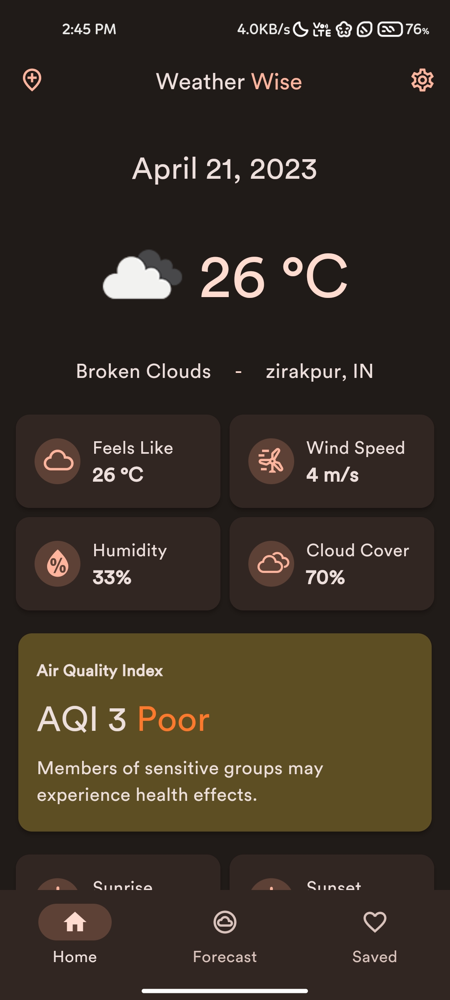
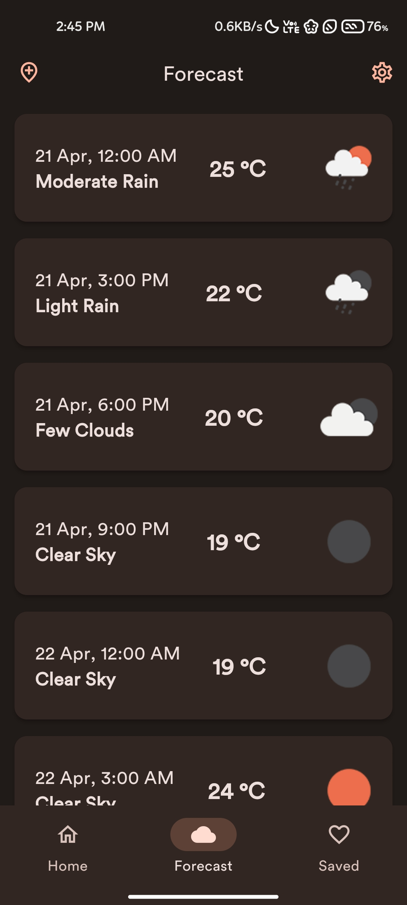
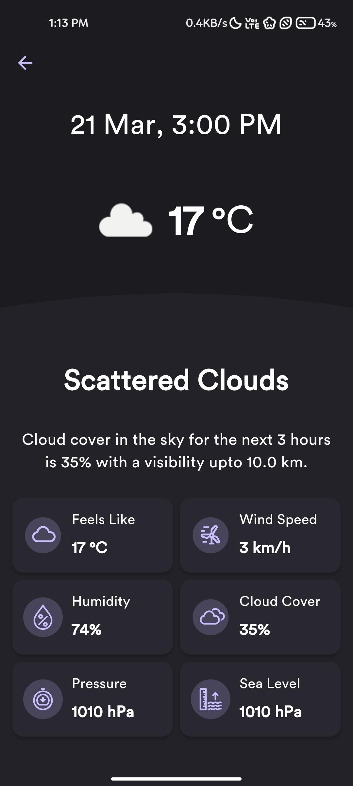
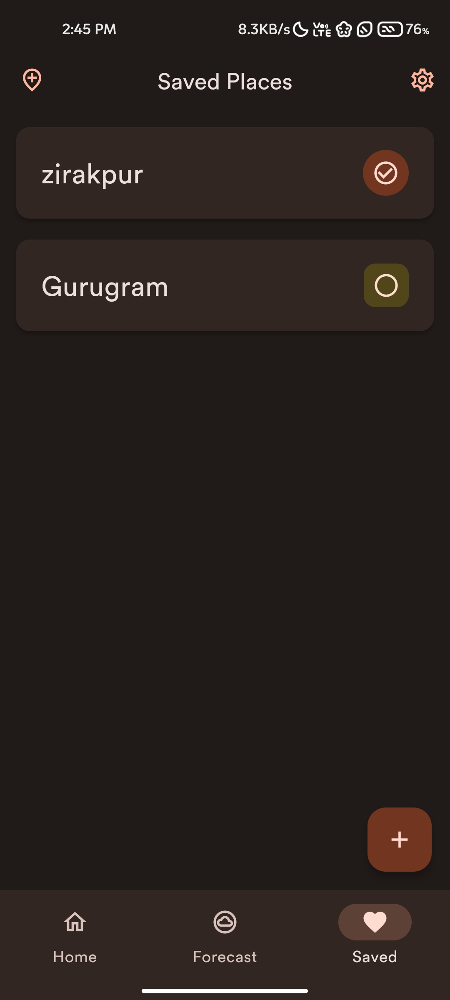
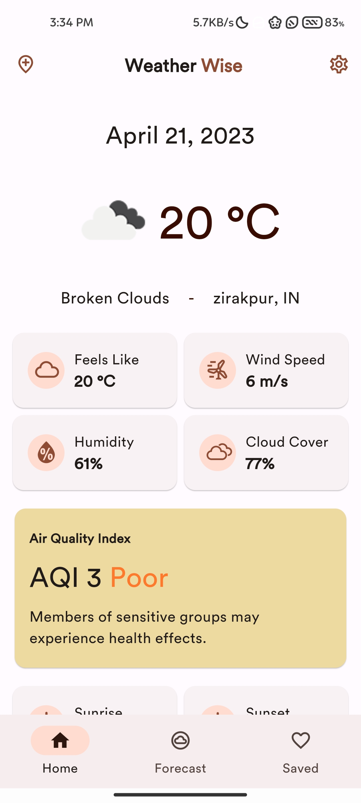
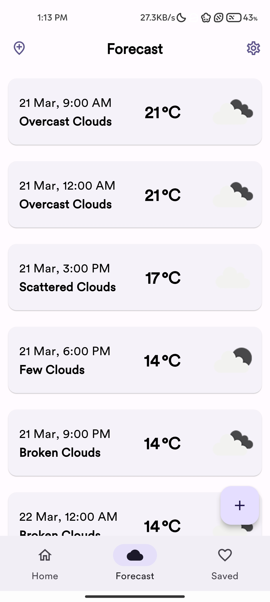
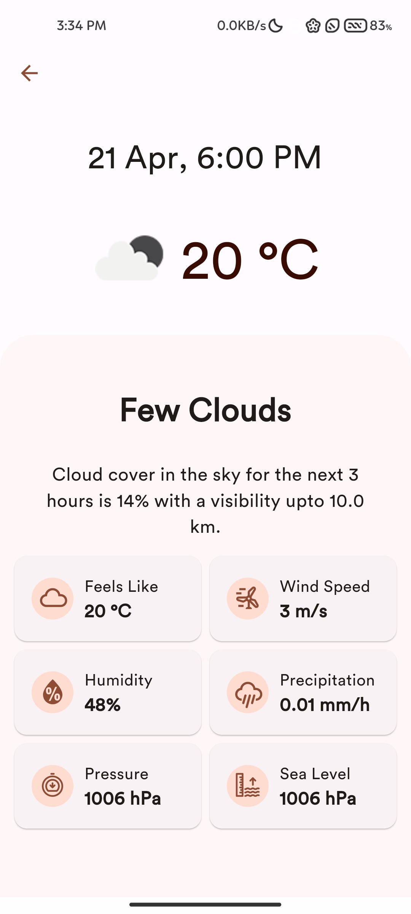
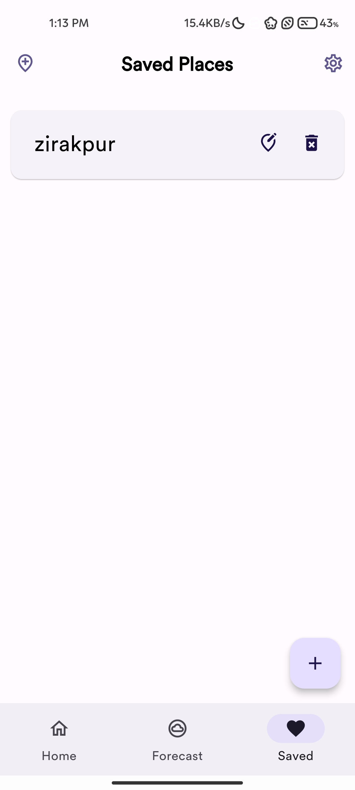

   
   <h2>WeatherWiseApp</h2>
   
a material design, <strong>closed source live-weather app</strong> for android with <strong>Material You</strong> theming.

---

## Features:

-  Proper material design with support for **material you design**
-  Custom accent colors for Android 11 and below.
-  Get **current weather**
-  Weather based on GPS location or manual entered text.
-  Get **forecast for 5 days of 3 hour interval**
-  Save locations locally and the ability to edit/delete them.
-  Theme switcher
-  Change temperature units
-  Change navigation label behaviour
-  Theme matching icons and splash icons

> Note:
>
> -  Android 12 & above will extract colors from wallpaper set on your device
> -  Other android versions uses accent colors within app to match material you system.

---

## General Information:

-  You can find all the releases in the releases section.
-  You can also create issues and give suggestions/feedbacks here

---

## Information Regarding apk files:

-  **arm64-v8a**: For 64-bit architecture devices
-  **armeabi-v7a**: For 32-bit architecture devices

---

## Screenshots:

#### Dark theme-

 
 

#### Light theme-

 
 

---

## Current todo:

-  Add multiple API or change to AccuWeather or best alternative
-  Add text auto complete for adding new location
-  UI Animations
-  Support for providing own API key
-  System based font (not supported by flutter)
-  Homescreen widgets (not natively supported by flutter)
