

   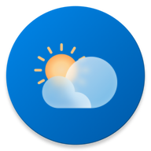
   <h2>WeatherWiseApp</h2>
   
a material design, <strong>closed source live-weather app</strong> for android with <strong>Material You</strong> theming.

## Donation:

## Downloads:

## Features:

-  Proper material design with support for **material you design**
-  Custom accent colours when dynamic colours are off.
-  Get **current weather data**
-  Get **forecast weather information for future periods**
-  Monet-based splash screen for Android 12+ devices.
-  Monochrome icon for Android 13+ devices.
-  **Beautiful home-screen widgets** for Android devices (Available in Glance, Pixel-style Glance, Detailed, tile & Omelette widgets)
-  **Cross-platform** support (Currently Android & Windows based devices)
-  Theme switcher (Light, dark and AMOLED/black mode)
-  Font chooser option from Google fonts
-  Weather-based on GPS location or manually entered text with autocomplete.
-  Save locations locally and the ability to delete them.
-  Change various units of measurement (temperature, wind, rain/snow, pressure)
-  Change navigation label behaviour
-  Change the icon style for your saved inactive places
-  Theme matching icons and splash icons
-  Material you based Android widgets
- Powerful Weather APIs such as [OpenWeather](https://openweathermap.org/api), [AccuWeather](https://www.accuweather.com/) and [FreeWeatherApi](https://weatherapi.com/)

> Note:
>
> -  Android 12 & above will extract colours from the wallpaper set on your device
> -  Other Android versions use accent colours within the app to match the material you system.

---

## General Information:

-  You can find all the releases in the releases section.
-  You can also create issues and give suggestions/feedback here

---

## Information Regarding release files:

-  **arm64-v8a**: For 64-bit architecture devices
-  **armeabi-v7a**: For 32-bit architecture devices
-  **universal**: For all devices irrespective of their architecture
-  **msix builds**: For windows devices

---

## Translators:

-  [Krystl](https://crowdin.com/profile/krystl) - Serbian (Latin)
-  [Evasion4715](https://crowdin.com/profile/evasion4715) - Russian
-  [Patrick Loidl](https://crowdin.com/profile/palo6415) - German
-  [KrystlMuhammad Rizqi Imani](https://crowdin.com/profile/rizqiimani) - Indonesian
-  [h 下划线 h](https://crowdin.com/profile/hunderlinehh) - Chinese Simplified
-  [Ákos Paha](https://crowdin.com/profile/pahaakos) - Hungarian
-  [Rippa NonProfit](https://crowdin.com/profile/rippanonprofit) - Spanish
-  [Vanitas](https://crowdin.com/profile/BlackSpectrum) - Gujarati
-  [ktodorov0](https://crowdin.com/profile/ktodorov0) - Bulgarian
-  [Lorenzo Geromel](https://crowdin.com/profile/lorenzo.geromel) - Italian
-  [Ant. Rares](https://crowdin.com/profile/iepurooy) - Romanian
-  [Lefteris T.](https://crowdin.com/profile/leftertrp) - Greek
-  [RikoDEV](https://crowdin.com/profile/rikodev) - Polish

---

## Screenshots:

#### Mobile-

| 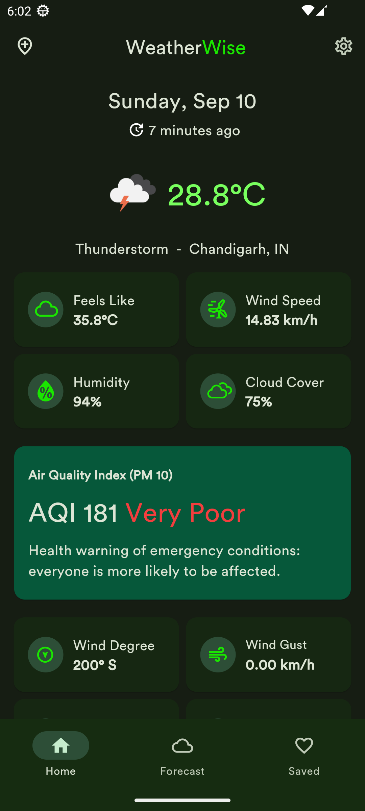 | 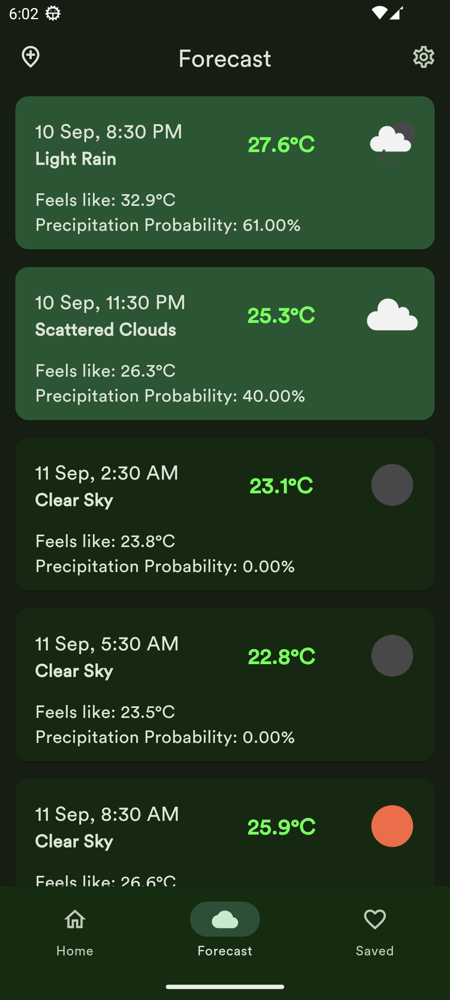 | 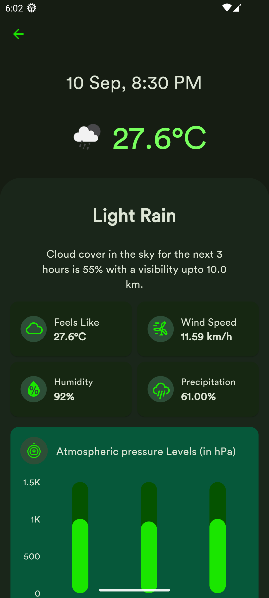 | 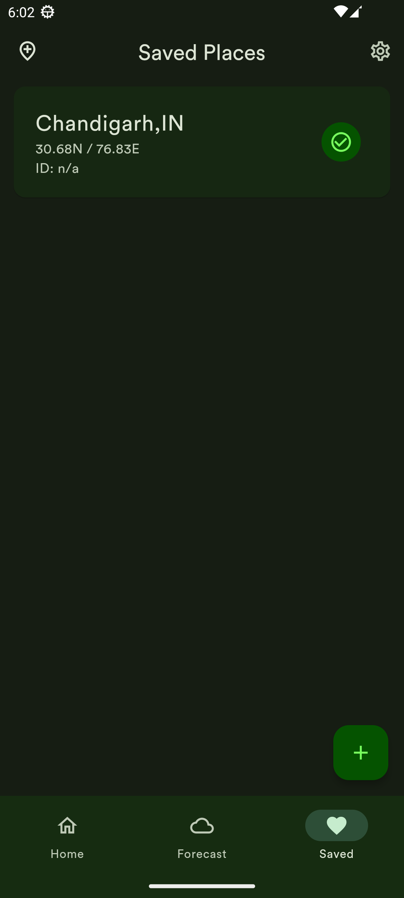 |
| ----------------------------------------------------------- | --------------------------------------------------------------- | ---------------------------------------------------------------------- | ------------------------------------------------------------ |

#### Foldables-

| 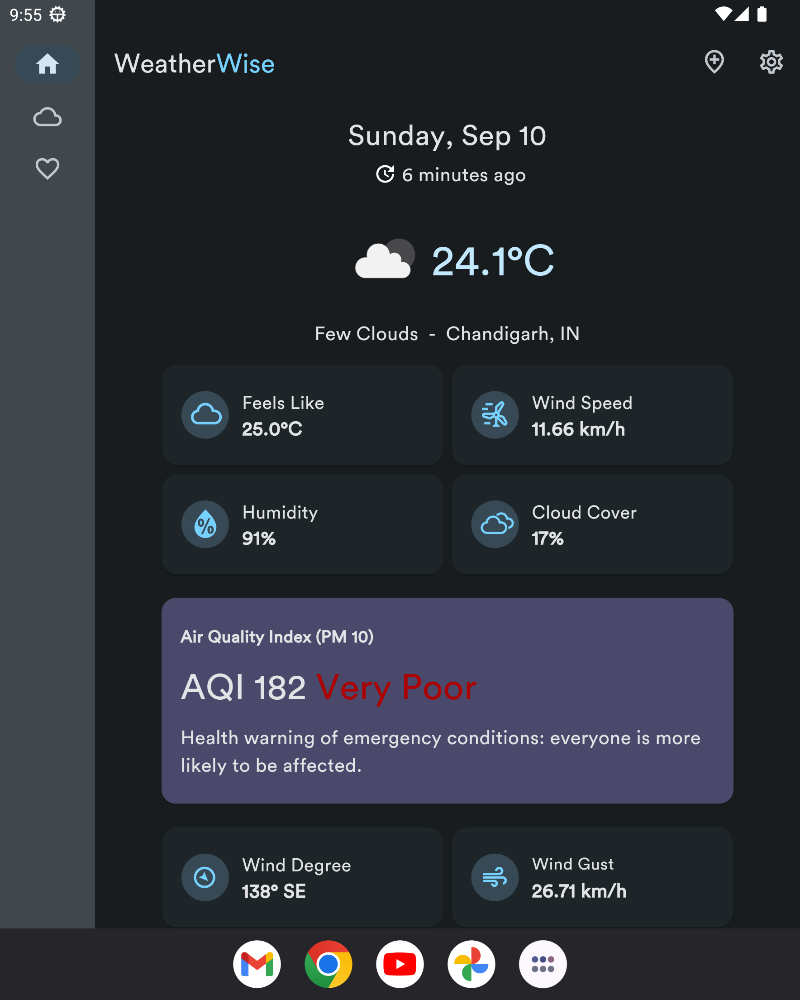 | 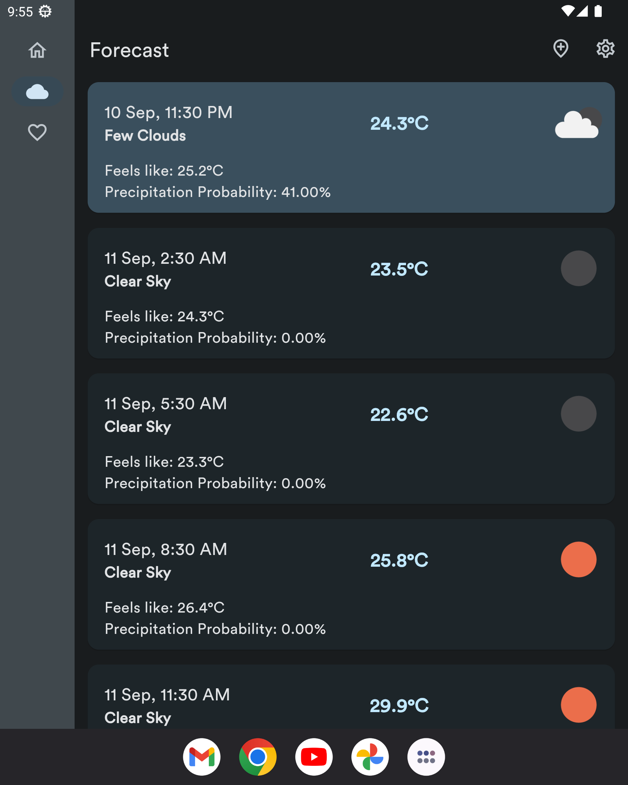 | 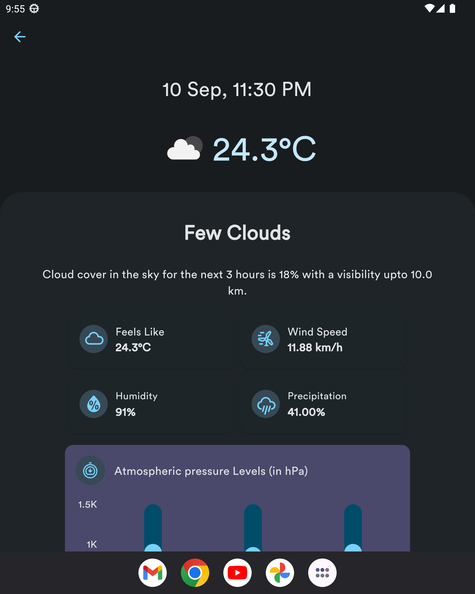 | 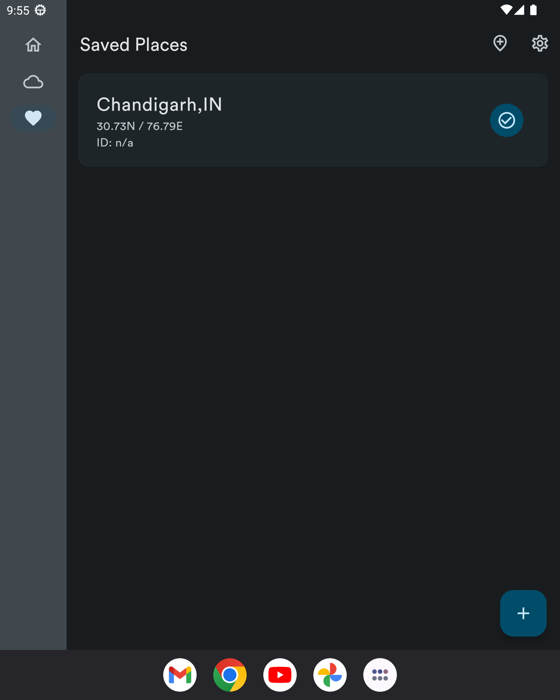 |
| ----------------------------------------------------------- | --------------------------------------------------------------- | ---------------------------------------------------------------------- | ------------------------------------------------------------ |

#### Tablet-

| 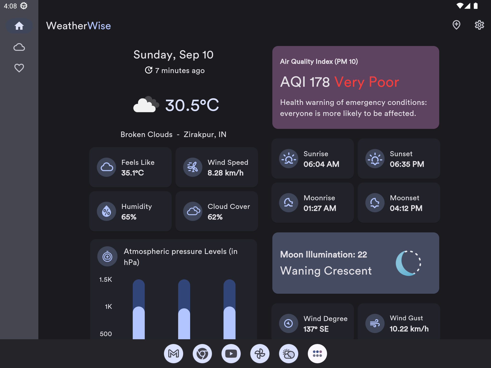 | 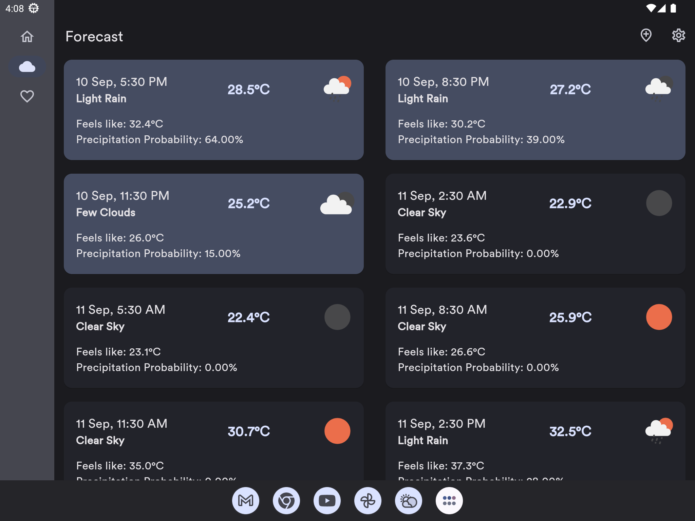 | 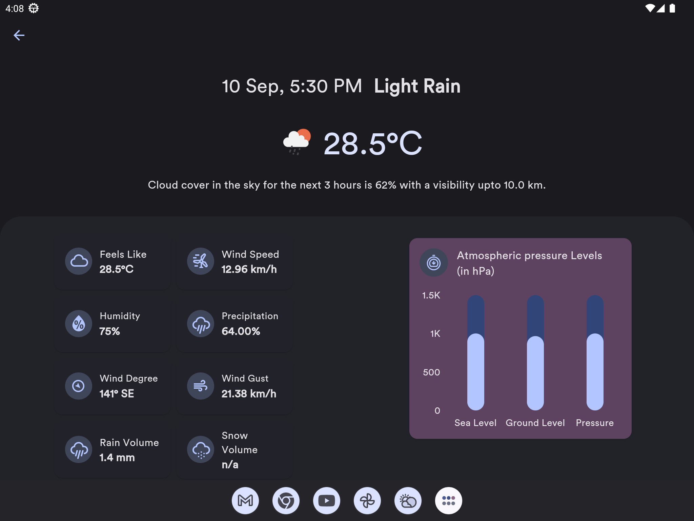 | 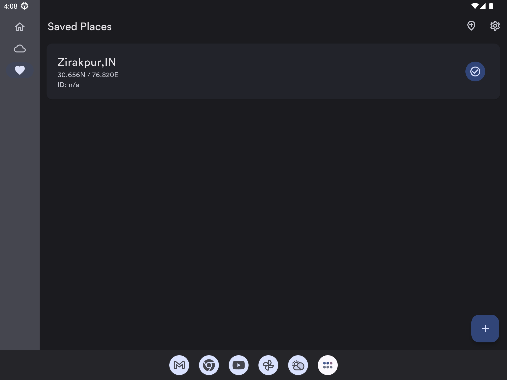 |
| ----------------------------------------------------------- | --------------------------------------------------------------- | ---------------------------------------------------------------------- | ------------------------------------------------------------ |

#### Desktop-

| 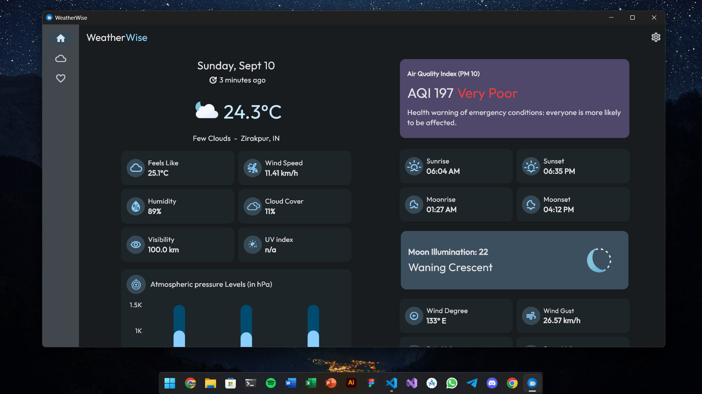 | 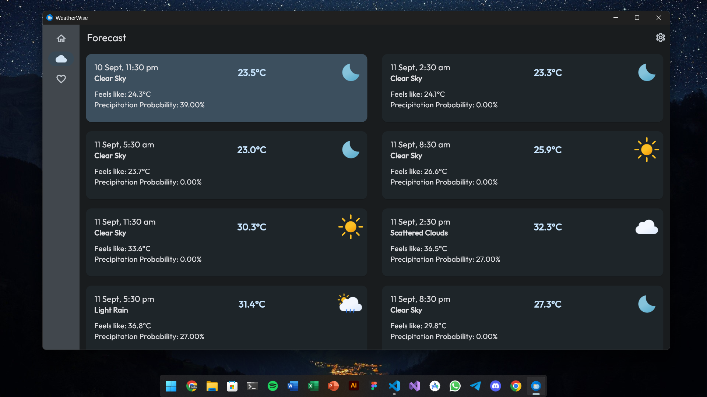 | 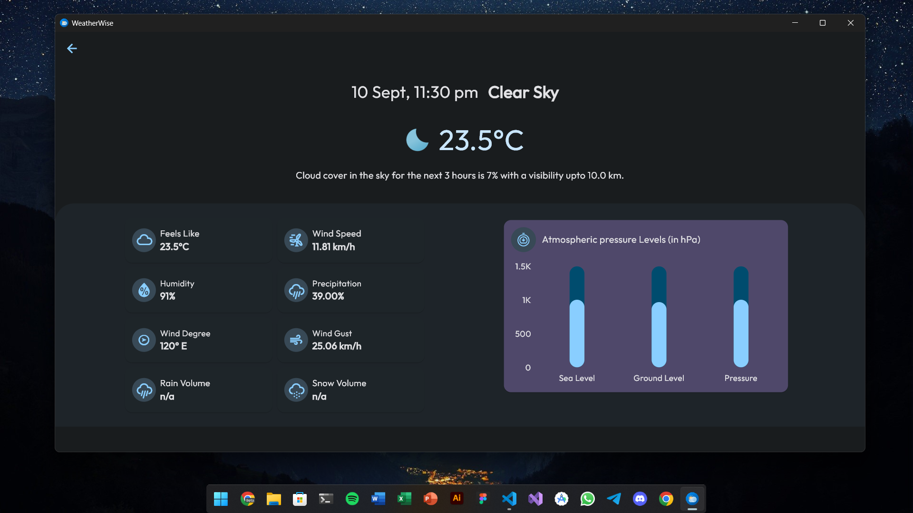 | 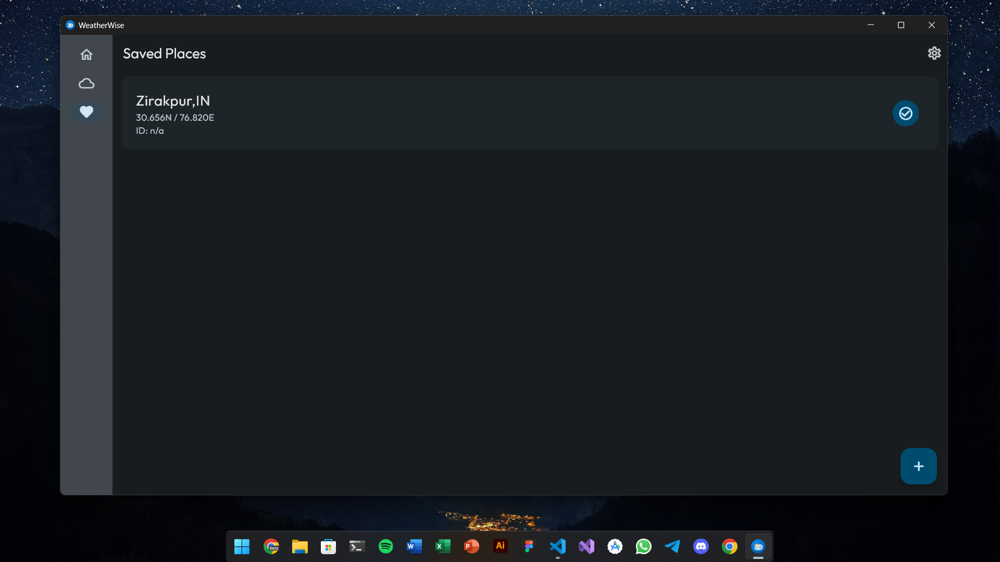 |
| ----------------------------------------------------------- | --------------------------------------------------------------- | ---------------------------------------------------------------------- | ------------------------------------------------------------ |

---

## Current todo:

-  [X] ~~Add multiple API support (Priority: LOW)~~ Done
-  [x] ~~Make homescreen widgets (Priority: LOW)~~ Done

## List of things not supported by flutter (officially or partially or not built-in):

-  [System based font ](https://github.com/flutter/flutter/issues/48381)
-  [Predictive back gestures](https://github.com/flutter/flutter/issues/132504)
-  [Per-app language preferences](https://github.com/flutter/flutter/issues/109842)
-  [Splash Screen for desktop app](https://github.com/flutter/flutter/issues/41980)
