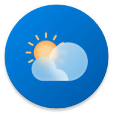

   
   <h2>WeatherWiseApp</h2>
   
a material design, <strong>closed source live-weather app</strong> for android with <strong>Material You</strong> theming.

## Donation:

## Downloads:

## Features:

**Visuals & Customization**
- Adaptive Material Design: Full support for Material You (Android 12+) with dynamic color extraction from your wallpaper.
- Dynamic Theming: Theme switcher including Light, Dark, and AMOLED/Black modes.
- Custom Color Palettes: Manual accent color selection when dynamic coloring is disabled.
- Typography: Integrated Google Fonts library with a built-in font chooser.
- Icon Customization: Monochrome icon support (Android 13+) and customizable icon styles for saved locations.

**Weather Intelligence**
- Precision Data: Real-time current conditions and detailed future forecasts.
- Global Search: Location tracking via GPS or manual entry with smart autocomplete.
- Multi-Source Reliability: Powered by industry-leading APIs including OpenWeather, AccuWeather, and WeatherAPI.
- Personalized Units: Fully adjustable measurements for temperature, wind speed, precipitation, and pressure.

**Android Integration**
- Versatile Widgets: A diverse collection of Material You widgets including Glance (Standard and Pixel-style), Detailed, Tile, and Omelette layouts.

**Utility & Management**
- Cross-Platform Availability: Seamless experience across Android and Windows devices.
- Location Manager: Securely save and manage a list of favorite locations locally.

> Note:
>
> -  Android 12 & above will extract colours from the wallpaper set on your device
> -  Other Android versions use accent colours within the app to match the Material You system.

---

## General Information:

-  You can find all the releases in the releases section.
-  You can also create issues and give suggestions/feedback here

---

## Information Regarding release files:

-  **arm64-v8a**: For 64-bit architecture devices
-  **armeabi-v7a**: For 32-bit architecture devices
-  **universal**: For all devices irrespective of their architecture
-  **msix builds**: For windows devices

---

## Translators:

-  [Krystl](https://crowdin.com/profile/krystl) - Serbian (Latin)
-  [Evasion4715](https://crowdin.com/profile/evasion4715) - Russian
-  [Patrick Loidl](https://crowdin.com/profile/palo6415) - German
-  [KrystlMuhammad Rizqi Imani](https://crowdin.com/profile/rizqiimani) - Indonesian
-  [h 下划线 h](https://crowdin.com/profile/hunderlinehh) - Chinese Simplified
-  [Ákos Paha](https://crowdin.com/profile/pahaakos) - Hungarian
-  [Rippa NonProfit](https://crowdin.com/profile/rippanonprofit) - Spanish
-  [Vanitas](https://crowdin.com/profile/BlackSpectrum) - Gujarati
-  [ktodorov0](https://crowdin.com/profile/ktodorov0) - Bulgarian
-  [Lorenzo Geromel](https://crowdin.com/profile/lorenzo.geromel) - Italian
-  [Ant. Rares](https://crowdin.com/profile/iepurooy) - Romanian
-  [Lefteris T.](https://crowdin.com/profile/leftertrp) - Greek
-  [RikoDEV](https://crowdin.com/profile/rikodev) - Polish
-  [Marco Polo](https://crowdin.com/profile/creusat.ma) - French

---

## List of things not supported by flutter (officially or partially or not built-in):

-  [System based font ](https://github.com/flutter/flutter/issues/48381)
-  [Per-app language preferences](https://github.com/flutter/flutter/issues/109842)
-  [Splash Screen for desktop app](https://github.com/flutter/flutter/issues/41980)
