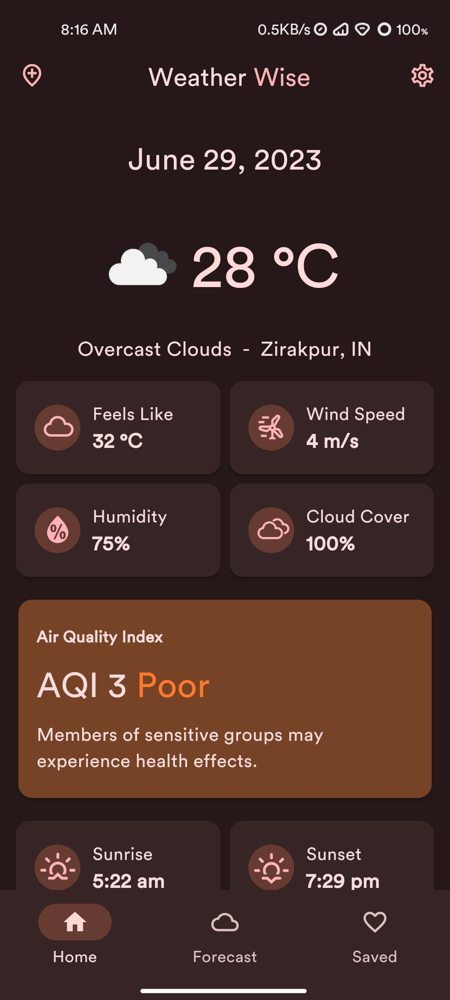
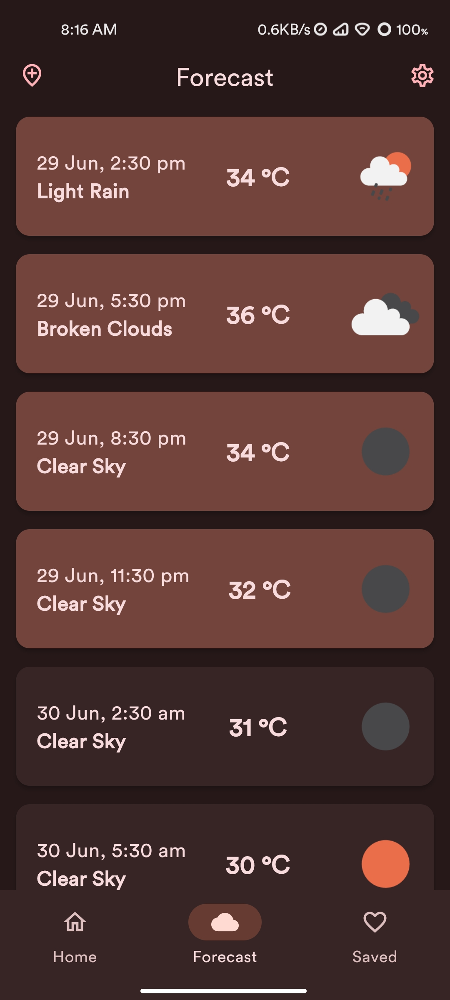
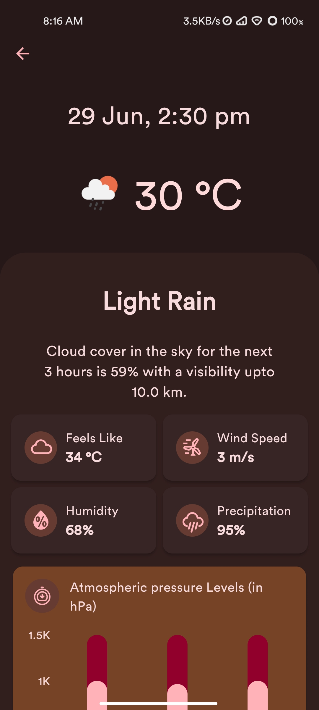

   
   <h2>WeatherWiseApp</h2>
   
a material design, <strong>closed source live-weather app</strong> for android with <strong>Material You</strong> theming.

---

## Features:

-  Proper material design with support for **material you design**
-  Custom accent colors when dynamic theming is off.
-  Get **current weather**
-  Weather based on GPS location or manual entered text with autocomplete.
-  Get **forecast for 5 days of 3 hour interval**
-  Save locations locally and the ability to delete them.
-  Theme switcher
-  Change temperature units
-  Change navigation label behaviour
-  Change inactive places icon style
-  Theme matching icons and splash icons

> Note:
>
> -  Android 12 & above will extract colors from wallpaper set on your device
> -  Other android versions uses accent colors within app to match material you system.

---

## General Information:

-  You can find all the releases in the releases section.
-  You can also create issues and give suggestions/feedbacks here

---

## Information Regarding apk files:

-  **arm64-v8a**: For 64-bit architecture devices
-  **armeabi-v7a**: For 32-bit architecture devices

---

## Translators:

-  [Krystl](https://crowdin.com/profile/krystl) - Serbian (Latin)
-  [Evasion4715](https://crowdin.com/profile/evasion4715) - Russian
-  [Patrick Loidl](https://crowdin.com/profile/palo6415) - German
-  [KrystlMuhammad Rizqi Imani](https://crowdin.com/profile/rizqiimani) - Indonesian
-  [h 下划线 h](https://crowdin.com/profile/hunderlinehh) - Chinese Simplified
-  [Ákos Paha](https://crowdin.com/profile/pahaakos) - Hungarian
-  [Rippa NonProfit](https://crowdin.com/profile/rippanonprofit) - Spanish
-  [Vanitas](https://crowdin.com/profile/BlackSpectrum) - Gujarati
-  [ktodorov0](https://crowdin.com/profile/ktodorov0) - Bulgarian
-  [Lorenzo Geromel](https://crowdin.com/profile/lorenzo.geromel) - Italian
-  [Ant. Rares](https://crowdin.com/profile/iepurooy) - Romanian

---

## Screenshots:

#### Dark theme-

 
 

#### Light theme-

 
 

---

## Current todo:

-  Add multiple API or change to AccuWeather or best alternative(not planned)
-  Make homescreen widgets

## List of things not supported by flutter (officially or partially or not built-in):

-  Homescreen widgets (Not built-in)
-  [System based font ](https://github.com/flutter/flutter/issues/48381)
-  [Predictive back gestures](https://github.com/flutter/flutter/issues/109513)
-  [Per-app language preferences](https://github.com/flutter/flutter/issues/109842)
